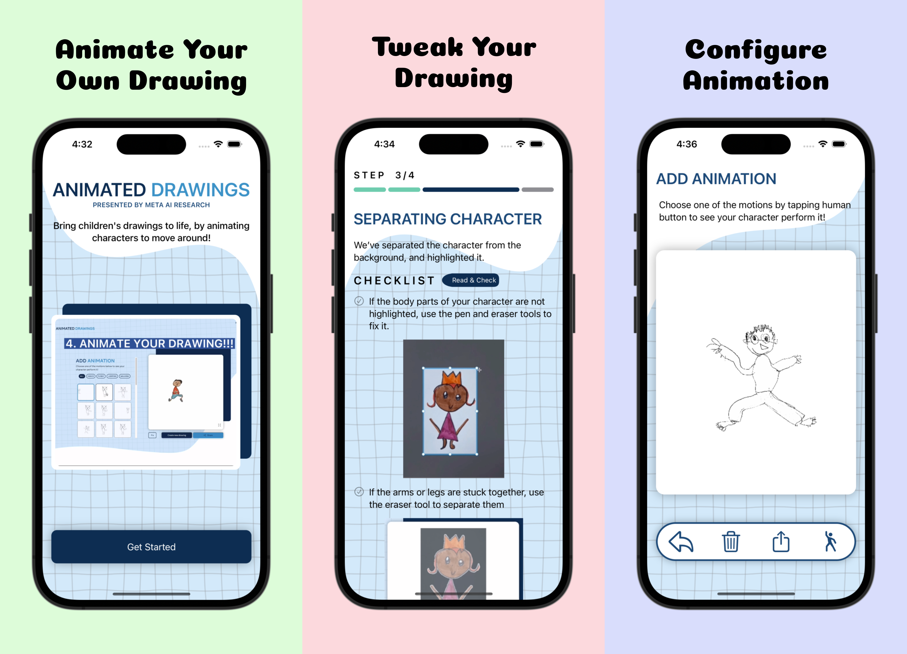

# Animated Drawing
그림을 움직이는 애니메이션으로 바꿔주는 iOS 앱입니다.
https://sketch.metademolab.com/ 웹을 클론코딩 했습니다.

# Micro Feature Architecture
[Tuist 공식문서](https://docs.tuist.io/building-at-scale/microfeatures/)에서 µFeatures Architecture라 불리는 Micro Feature Architecture를 적용했습니다. 프로젝트의 모듈 분리는 아래 그래프 그림과 같습니다.

## Dependencies Graph

### 5 Layer
- App : 프로젝트 앱
- Presentation : 뷰와 뷰로직 관련 코드
- Domain : 데이터를 Presentation 영역에 사용할 수 있게 가공, Presentation, Core 사이의 다리역할
- Core : 데이터 CRUD 작업을 할 수 있는 Storage
- Shared : 외부 라이브러리를 포함한 공용 모듈

# Library
- [TCA](https://github.com/pointfreeco/swift-composable-architecture)

# Rules
- [Swift Style Guide](https://github.com/airbnb/swift)
- [Commit Convention](docs/CommitConvention.md)
- Git Flow 적용
    - main, develop, (feature, design ...) 브랜치 운영
    - 되도록 두줄
